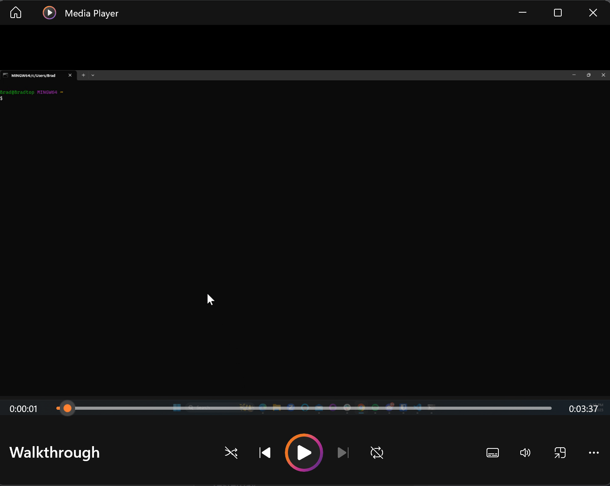

  ## License
  

  
    
  README Generator
  
  ## Description
  generates readmes
    
  ## Table of Contents
    
  - [Description](#description)
  - [Installation](#installation)
  - [Usage](#usage)
  - [Contribution](#contribution)
  - [Test](#test)
  - [Questions](#questions)
  - [License](#license)

  ## Installation
  clone, navigate to file, npm i, type node index.js

  

  
       
	Click the thumbnail above to view the video.

  ## Usage
  almost the same as installation

  ## Contribution
  fork to your github, clone, edit on branch, push

  ## Test
  N/A

  ## Questions
  If you have any questions, please contact me at bradfh@gmail.com or visit my GitHub page at https://www.github.com/bradfh
  
